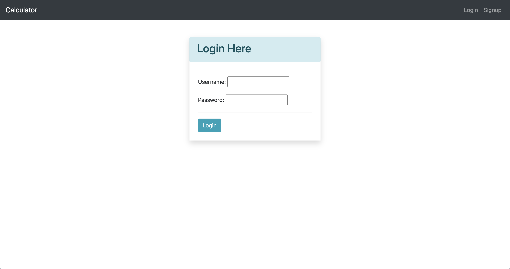
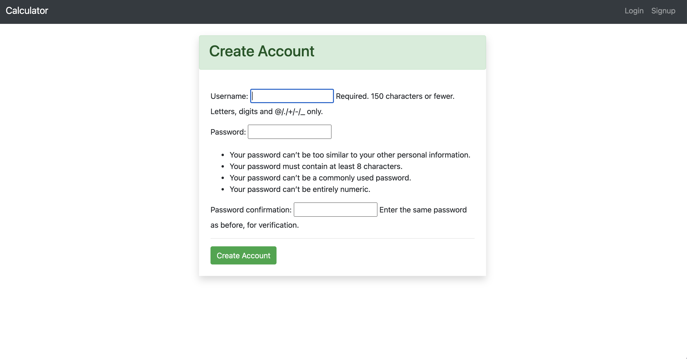
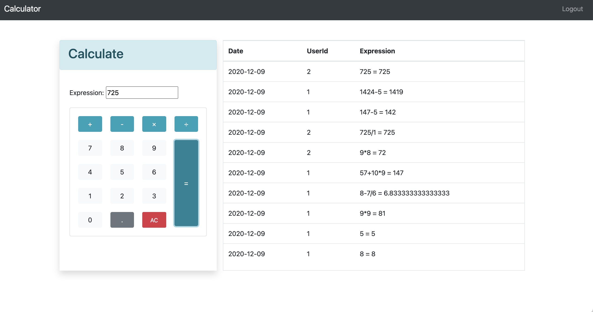

# Online calculator chatting room

## Online Demo(notes: http not https)
http://calculator-chatting-room.herokuapp.com/


## Features
User Authentication \
Real time showing calculation results \
Latest 10 calculations records

## How to run
install virtual environments and install packages
```bash
pip install -r requirements.txt
```

run redis
```bash
docker run -p 6379:6379 -d redis:5
```

run server
```bash
python manage.py runserver

```

## Related techniques 
### Front-end:
HTML \
CSS \
Bootstrap \
JavaScript

### Back-end
Python3 \
Django - python web framework \
Channels - project based on Django, which can handle WebSockets \
Redis - database cashing \
sqlite3 - database


## ScreenShots





## Todos
Didn't finish Django object serializers(user name column show's id instead of username)\
At first used docker-compose run locally, but didn't figure out how to deploy it on Heroku\
Static files cannot be found when deployed on Heroku, just put in html file

## Resources
Calculator CSS style:
https://mdbootstrap.com/snippets/jquery/ascensus/456902#css-tab-view

Channels tutorial:
https://channels.readthedocs.io/en/stable/tutorial/index.html

User Authentication: \
https://github.com/twtrubiks/django-chat-room/tree/master/account

Deploy on Heroku: \
https://github.com/veryacademy/YT-Django-Heroku-Deploy-Channels-Daphne


 
